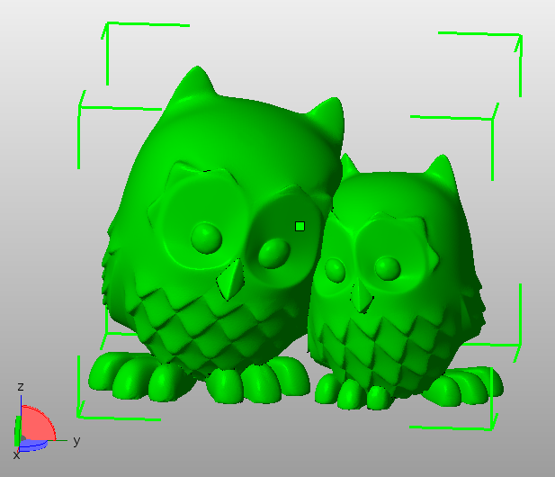

# ADMesh Assignment

Za tři body na cvičení naprogramujte program v jazyce C, C++,
[Python](https://pypi.org/project/admesh/) nebo
[Ruby](https://rubygems.org/gems/radmesh/),
který pro zadaný STL soubor (první argument volání programu) najde nejvhodnější
rotaci kolem osy Z tak, aby plocha obdélníkové podstavy pomyslného opsaného
hranolu objektu byla co nejmenší – hrany pomyslného opsaného hranolu jsou
rovnoběžné s osami X, Y nebo Z.

Do repozitáře vytvořeného na odkazu https://classroom.github.com/a/...
dejte soubor `bestrot` s příponou `c`, `cpp`, `py` nebo `rb` podle zvoleného
jazyka (např. `bestrot.c`). Je povoleno použít pouze standardní knihovnu jazyka
a ADMesh (u Ruby RADMesh).

Ilustrační obrázek z Netfabbu ukazující opsaný hranol s obdélníkovou podstavou:



(Model CC BY-NC 3.0 © [Daniel Moos](https://www.thingiverse.com/thing:50212).)

Program vypíše na standardní výstup úhel otočení (ve stupních), obsah postavy
opsaného hranolu (ten nejlepší nalezený), a do souboru zadaného druhým
argumentem (z příkazové řádky) uloží orotovaný soubor v takovém formátu
(ASCII/binary), v jakém byl načten
vstupní soubor.

Příklad výstupu:

```
65
897489645.867869
```

Pro ukázku můžete použít následující STL, ale program musí umět pracovat s jakýmkoliv STL.

  * [hellskull.stl](hellskull.stl) ([CC BY-ND Ola Sundberg](https://www.thingiverse.com/thing:479949))

Vhodný úhel nalezněte bruteforce metodou pro úhly otočení v násobcích 5°
(5°, 10°, 15°, ...).

Vhodné funkce a údaje:

  * `stl_rotate_z(&stl_in, angle_in_degrees)` – rotuje kolem osy Z, o daný počet stupňů
  * `<stl_file>.stats.number_of_facets` je počet trojúhelníků v STL
  * `<stl_file>.facet_start` je ukazatel na první trojúhelník (a jde k němu přistupovat jako k poli)
  * trojúhelníky jsou uloženy v strukturách `stl_facet` obsahující v trojprvkovém poli `vertex` tři vrcholy (struktura `stl_vertex` obsahující tři floaty `x`, `y` a `z`)
  * zajímavé údaje jsou uloženy i ve `stl_file.stats`
